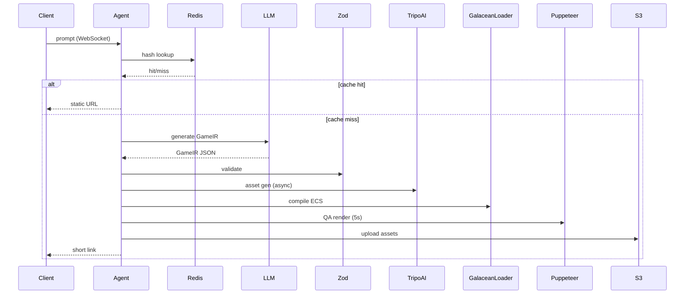

# ZeroLoop Execution Pipeline

> 8-step control flow: WebSocket prompt → Redis gate → LLM parse → Zod validate → async asset gen → ECS compile → Puppeteer QA → S3 upload.

## System Flow



## Steps

```
1. INPUT    Client → WebSocket → agent(prompt: string)
2. CACHE    Redis.hget(hash(prompt))
              → HIT:  return staticUrl → EXIT
              → MISS: continue
3. PARSE    agent → LLM(prompt) → GameIR (JSON)
4. VALIDATE Zod.parse(GameIR)
              → FAIL: retry (max 3)
              → 3rd fail: throw PipelineError
5. ASSET    IF GameIR.MeshRenderer.needsNewAsset
              → skills/tripo_downloader(asset) [async, non-blocking]
              → LOCAL lib = primary source; Tripo = fallback
6. COMPILE  adapters/galacean-loader.ts
              → map(GameIR) → GalaceanECS (in-memory)
7. QA       Puppeteer.render(scene, timeout=5000ms)
              → assert FPS >= 30
              → assert !hasNaN(coords)
8. OUTPUT   QA pass  → S3/OSS.upload() → return shortLink
            QA fail  → destroy(scene) → retry from step 3
```

## Data Models

```typescript
interface PipelineInput {
  prompt: string;
  clientId: string; // WebSocket session
}

interface CacheResult {
  hit: boolean;
  staticUrl?: string;
}

interface QAResult {
  pass: boolean;
  fps: number;         // must be >= 30
  hasNaNCoords: boolean; // must be false
}

type PipelineOutcome =
  | { status: "cached"; url: string }
  | { status: "generated"; url: string }
  | { status: "error"; reason: string };
```

## Critical Rules

- Redis cache check is MANDATORY before any LLM or Tripo invocation.
- Local asset library is PRIMARY. Tripo is FALLBACK only.
- Single-player, client-side rendering. No multiplayer sync.
- LLM validation retry budget: 3 attempts max.
- QA failure resets to step 3 (PARSE), not step 1.
- Asset generation (step 5) is async and non-blocking; pipeline continues.

## Retry Budget

| Failure Point     | Retry Limit | Resume At  |
| :---------------- | :---------- | :--------- |
| Zod validation    | 3           | Step 3     |
| Puppeteer QA fail | unlimited*  | Step 3     |

*QA retry inherits the LLM validation budget on re-entry.
